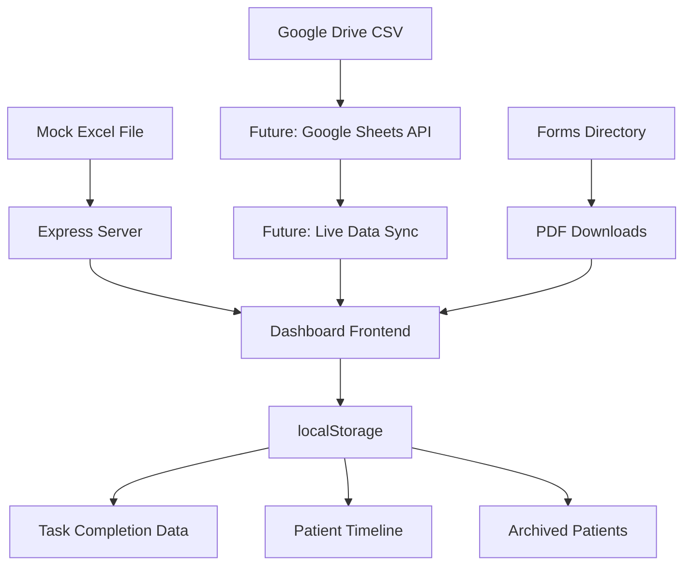

# 📊 Data Schema Mapping - Hospice Patient Management Dashboard

## 🎯 **Overview**
This document maps the relationship between mock data sources and the live dashboard implementation, facilitating the transition from test data to production data.

---

## 📁 **Data Sources**

### **Current Mock Data Sources**
- **Excel File**: `Dashboard Clone.xlsx` (Local file)
- **Google Drive**: Installed locally on Mac
  - **Mac Path**: `/Users/[username]/Google Drive/`
  - **PC Path**: `G:\Google Drive\` (when installed)
- **Target Location**: `Google Drive/Sheets/Project/[filename].csv`

### **Dashboard Implementation**
- **Frontend**: `public/app.js` (5,379 lines)
- **Backend**: `server.js` + `sync.js`
- **Data Storage**: `localStorage` + Excel file reading

---

## 🗂️ **Sheet-by-Sheet Data Mapping**

### **1. Active Patients Sheet**

| Column Index | Mock Data Field | Dashboard Field | Data Type | Description | Status |
|--------------|-----------------|-----------------|-----------|-------------|---------|
| 0 | `ti` | `patient.id` | String | Patient ID | ✅ Mapped |
| 1 | `Date` | `patient.dateSubmitted` | Date | Entry Date | ✅ Mapped |
| 2 | `Patient Name` | `patient['Patient Name']` | String | **Primary Key** | ✅ Mapped |
| 3 | `DOB` | `patient.DOB` | Date | Date of Birth | ✅ Mapped |
| 4 | `Age` | `patient.Age` | Number | Patient Age | ✅ Mapped |
| 5 | `City` | `patient.City` | String | Geographic Location | ✅ Mapped |
| 6 | `Phone Number` | `patient['Phone Number']` | String | Contact Phone | ✅ Mapped |
| 7 | `Email` | `patient.Email` | String | Contact Email | ✅ Mapped |
| 8 | `1st request` | `patient['1st request']` | Date | First Request | ✅ Mapped |
| 9 | `2nd request` | `patient['2nd request']` | Date | Second Request | ✅ Mapped |
| 10 | `CP Doctor` | `patient['CP Doctor']` | String | Consulting Physician | ✅ Mapped |
| 11 | `CP Completed` | `patient['CP Completed']` | String | CP Status | ✅ Mapped |
| 12 | `RXNT Info` | `patient['RXNT Info']` | String | RXNT Status | ✅ Mapped |
| 13 | `WR` | `patient.WR` | String | Written Request | ✅ Mapped |
| 14 | `Hospice` | `patient.Hospice` | String | Hospice Provider | ✅ Mapped |
| 15 | `Prescription Submit` | `patient['Prescription Submit']` | Date | Prescription Date | ✅ Mapped |
| 16 | *(Empty)* | - | - | Separator | - |
| 17 | `invoice amount` | `patient['invoice amount']` | Number | Billing Amount | ✅ Mapped |
| 18 | `PAID` | `patient.PAID` | String | Payment Status | ✅ Mapped |
| 19 | `Check list` | `patient['Check list']` | String | Completion Status | ✅ Mapped |
| 20 | `Ingestion Date` | `patient['Ingestion Date']` | Date | Ingestion Date | ✅ Mapped |
| 21 | `Ingestion Location` | `patient['Ingestion Location']` | String | Location Type | ✅ Mapped |
| 22 | `TTS (Minutes)` | `patient['TTS (Minutes)']` | Number | Time to Start | ✅ Mapped |
| 23 | `TTD (Minutes)` | `patient['TTD (Minutes)']` | Number | Time to Death | ✅ Mapped |
| 24 | `Consent Received` | `patient['Consent Received']` | String | Consent Status | ✅ Mapped |
| 25 | `Medical Records` | `patient['Medical Records']` | String | Records Status | ✅ Mapped |
| 26 | `Physician follow up form` | `patient['Physician follow up form']` | Date | Follow-up Date | ✅ Mapped |
| 27 | `EOLOA State` | `patient['EOLOA State']` | String | EOLOA State | ✅ Mapped |
| 28 | `Death Certificate` | `patient['Death Certificate']` | String | Death Cert Status | ✅ Mapped |
| 29 | `All Recodrs in DRC` | `patient['All Recodrs in DRC']` | String | DRC Records | ✅ Mapped |
| 30 | *(Empty)* | - | - | Separator | - |
| 31 | `Riverside EOLOA` | `patient['Riverside EOLOA']` | String | Riverside Status | ✅ Mapped |
| 32 | `Referred From` | `patient['Referred From']` | String | Referral Source | ✅ Mapped |
| 33-35 | *(null)* | - | - | Empty Columns | - |

---

### **2. Past Patient Outreach Sheet**

| Mock Data Field | Dashboard Field | Data Type | Description | Status |
|-----------------|-----------------|-----------|-------------|---------|
| `Patient Name` | `outreach.patientName` | String | Patient Identifier | ✅ Mapped |
| `Recipient` | `outreach.recipient` | String | Contact Person | ✅ Mapped |
| `Relationship` | `outreach.relationship` | String | Relationship to Patient | ✅ Mapped |
| `Contact Email` | `outreach.contactEmail` | String | Contact Email | ✅ Mapped |
| `Contact Number` | `outreach.contactNumber` | String | Contact Phone | ✅ Mapped |
| `Something To Mention` | `outreach.notes` | String | Special Notes | ✅ Mapped |
| `Last Contact Date` | `outreach.lastContactDate` | Date | Last Contact | ✅ Mapped |
| `Date Sent` | `outreach.dateSent` | String | Date Sent | ✅ Mapped |
| `Response` | `outreach.response` | String | Response Status | ✅ Mapped |

---

### **3. Consulting Docs Sheet**

| Mock Data Field | Dashboard Field | Data Type | Description | Status |
|-----------------|-----------------|-----------|-------------|---------|
| `Name` | `doctor.name` | String | Doctor Name | ✅ Mapped |
| `Company` | `doctor.company` | String | Practice/Company | ✅ Mapped |
| `License Number` | `doctor.licenseNumber` | String | Medical License | ✅ Mapped |
| `Address` | `doctor.address` | String | Practice Address | ✅ Mapped |
| `Phone Number` | `doctor.phoneNumber` | String | Contact Phone | ✅ Mapped |
| `Active` | `doctor.active` | String | Active Status | ✅ Mapped |

---

### **4. Call Log Sheet**

| Mock Data Field | Dashboard Field | Data Type | Description | Status |
|-----------------|-----------------|-----------|-------------|---------|
| `Date` | `call.date` | Date | Call Date | ✅ Mapped |
| `Time` | `call.time` | String | Call Time | ✅ Mapped |
| `Person Contact` | `call.personContact` | String | Contact Person | ✅ Mapped |
| `Number` | `call.number` | String | Phone Number | ✅ Mapped |
| `In/Out` | `call.direction` | String | Call Direction | ✅ Mapped |
| `Patient` | `call.patient` | String | Patient Name | ✅ Mapped |
| `Outcome` | `call.outcome` | String | Call Outcome | ✅ Mapped |
| `Referral` | `call.referral` | String | Referral Made | ✅ Mapped |
| `Source` | `call.source` | String | Call Source | ✅ Mapped |

---

## 🔄 **Data Flow Architecture**



---

## 📊 **Dashboard Data Structures**

### **Patient Object (Active)**
```javascript
const patient = {
  // Core Identifiers
  id: 'PAT-1234567890-abc123',           // Generated unique ID
  'Patient Name': 'Adam Jones',           // Primary key
  'DOB': 14647,                          // Excel serial date
  'Age': 84,                             // Calculated age
  
  // Contact Information
  'Phone Number': '555-1234',
  'Email': 'adam@email.com',
  'City': 'san diego',
  
  // Medical Information
  'CP Doctor': 'Andzel, Gaja',
  'Hospice': 'Radiant',
  'doseLevel': 'regular',                // Added by dashboard
  
  // Status Fields
  'PAID': 'yes',
  'Check list': 'complete',
  'CP Completed': 'complete',
  'WR': 'yes',
  'RXNT Info': 'complete',
  
  // Financial
  'invoice amount': 4200,
  'Prescription Submit': 45524,
  
  // Timeline Data
  'Ingestion Date': 45525,
  'Ingestion Location': 'residents',
  'TTS (Minutes)': 3,
  'TTD (Minutes)': 64,
  
  // Legal/Compliance
  'Consent Received': 'yes',
  'Medical Records': 'yes',
  'Physician follow up form': 45526,
  'EOLOA State': 'CA',
  'Death Certificate': 'yes',
  'All Recodrs in DRC': 'yes',
  'Riverside EOLOA': 'yes',
  
  // Metadata
  'Date': 45523,
  'Referred From': 'Radiant Hospice',
  'dateSubmitted': '2024-07-01',         // Added by dashboard
  'dateSubmittedFormatted': 'July 1, 2024' // Added by dashboard
};
```

### **Task Completion Data**
```javascript
const taskCompletionData = {
  'patient-adam-jones-0': [
    {
      id: 'wr',
      name: 'Send Adobe Forms',
      subtasks: [
        {
          name: 'Written Request',
          complete: false,
          subSubtasks: [
            { name: 'Completed by Patient', complete: false }
          ]
        },
        { name: 'Payment Schedule Form', complete: false }
      ]
    },
    // ... 10 more tasks
  ]
};
```

---

## 🔧 **Transition Checklist**

### **Phase 1: Data Source Setup**
- [ ] **Locate Google Drive on Mac**: `/Users/[username]/Google Drive/`
- [ ] **Create project folder**: `Google Drive/Sheets/Project/`
- [ ] **Export Excel to CSV**: Convert `Dashboard Clone.xlsx` to CSV format
- [ ] **Upload to Google Drive**: Place CSV files in project folder
- [ ] **Create Google Sheets**: Import CSV files into Google Sheets

### **Phase 2: API Integration**
- [ ] **Set up Google Sheets API**: Enable API access
- [ ] **Configure OAuth**: Set up authentication
- [ ] **Update sync.js**: Modify to read from Google Sheets instead of Excel
- [ ] **Test data retrieval**: Verify all fields are accessible
- [ ] **Update data mapping**: Ensure field names match exactly

### **Phase 3: Data Validation**
- [ ] **Field mapping verification**: Check each field maps correctly
- [ ] **Data type validation**: Ensure dates, numbers, strings are correct
- [ ] **Required field check**: Verify all critical fields are present
- [ ] **Enum value validation**: Check status fields have valid values
- [ ] **Relationship integrity**: Verify foreign key relationships

### **Phase 4: Dashboard Updates**
- [ ] **Update data loading**: Modify `loadPatientTimelines()` function
- [ ] **Update patient intake**: Modify `handleIntakeSubmit()` function
- [ ] **Update archiving**: Modify `archivePatient()` function
- [ ] **Update search/filter**: Modify search functions
- [ ] **Update export**: Modify `exportPatientData()` function

---

## 📝 **Field Mapping Notes**

### **Critical Fields (Must Map)**
- `Patient Name` → Primary identifier across all systems
- `Date` → Chronological ordering
- `Age` → Calculated from DOB
- `PAID` → Financial status
- `Check list` → Overall completion status

### **Optional Fields (Can Map Later)**
- `ti` → Often null, low priority
- Empty columns (16, 30, 33-35) → Can be ignored
- `null` columns → Can be ignored

### **Data Type Conversions**
```javascript
// Excel serial dates to ISO dates
function excelToISO(excelSerial) {
    const date = new Date((excelSerial - 25569) * 86400 * 1000);
    return date.toISOString().split('T')[0];
}

// Boolean-like strings to booleans
function stringToBoolean(value) {
    return value?.toLowerCase() === 'yes';
}

// Enum validation
const validStatuses = {
    'CP Completed': ['complete', 'pending'],
    'Check list': ['complete', 'in progress'],
    'PAID': ['yes', 'no'],
    'WR': ['yes', 'no']
};
```

---

## 🚨 **Migration Risks & Mitigation**

### **High Risk**
- **Data Loss**: Mock data not backed up
  - *Mitigation*: Export all mock data to CSV before migration
- **Field Mismatch**: Column names don't match
  - *Mitigation*: Use this mapping document to verify each field
- **Data Type Issues**: Dates/numbers not formatted correctly
  - *Mitigation*: Test data conversion functions thoroughly

### **Medium Risk**
- **Performance**: Google Sheets API slower than local Excel
  - *Mitigation*: Implement caching and batch operations
- **Authentication**: Google OAuth setup complexity
  - *Mitigation*: Test authentication flow in development

### **Low Risk**
- **UI Updates**: Dashboard may need minor adjustments
  - *Mitigation*: Test all dashboard functions after migration

---

## 📋 **File Locations**

### **Current Mock Data**
- **Excel File**: `./Dashboard Clone.xlsx`
- **Server Code**: `./server.js`
- **Sync Code**: `./sync.js`
- **Frontend**: `./public/app.js`

### **Future Live Data**
- **Google Drive**: `/Users/[username]/Google Drive/Sheets/Project/`
- **CSV Files**: `[sheet-name].csv`
- **Google Sheets**: `[sheet-name]` (in Google Drive)

---

## 🔍 **Testing Strategy**

### **Pre-Migration Testing**
1. **Mock Data Validation**: Verify all mock data is complete
2. **Field Mapping Test**: Test each field mapping individually
3. **Data Type Test**: Verify all conversions work correctly
4. **UI Test**: Ensure dashboard displays all data correctly

### **Post-Migration Testing**
1. **Data Integrity**: Verify no data loss during migration
2. **Functionality Test**: Test all dashboard features
3. **Performance Test**: Verify acceptable load times
4. **User Acceptance**: Test with actual users

---

## 📞 **Support Information**

### **Google Drive Setup**
- **Mac**: Applications → Google Drive → Right-click → "Open Google Drive folder"
- **PC**: File Explorer → Google Drive (G: drive)
- **Web**: drive.google.com

### **Google Sheets API**
- **Documentation**: https://developers.google.com/sheets/api
- **Authentication**: OAuth 2.0
- **Rate Limits**: 100 requests per 100 seconds per user

---

*Last Updated: [Current Date]*
*Version: 1.0*
*Status: Ready for Migration*
